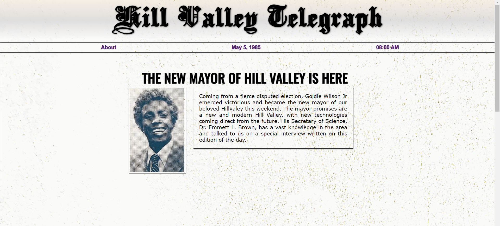
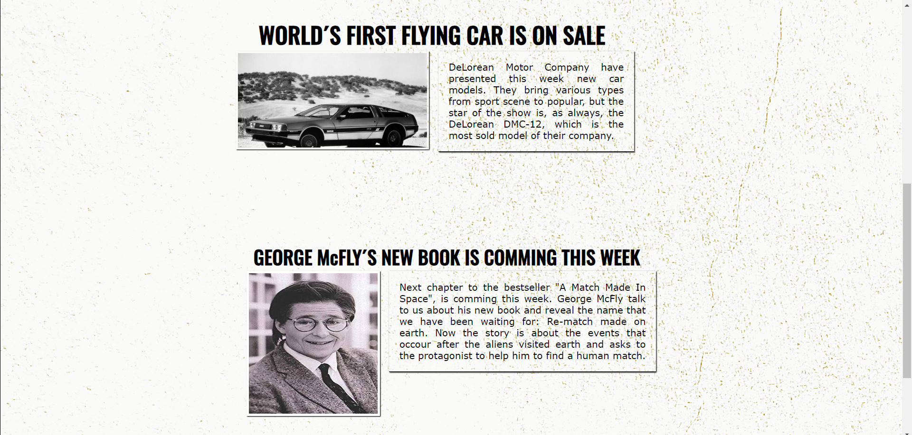

# Newspaper

Deploy: https://newspaper-jade.vercel.app/

Youtube: https://youtu.be/1wlVe_Rzvko?si=0DzaoS4AlHGmWpXI

## About

It´s a Back to the future inspired newpaper, The Hill Valley Telegraph. My idea is to create an online version of the infamous newspaper of this classic fiction movie.

### Objectives

To present my software developing skills that i learned from about 11 mounths of studying online.

### Challenges

It was a challenge for me to create a news website, using grid and flexbox. I was struggling to put everything in order, but in the end i made it the way i imagined. There is a long way to go to make it better, and i´ll continue to update it.

### Conclusion

It was a nice experience to create this project, i only used my actual knowlegde, and i still studying Javascript. When i fisnish my studies i´ll make better versions of this website, with others themes to boost my creativity.

### Tools

- HTML
- CSS
- Javascript
